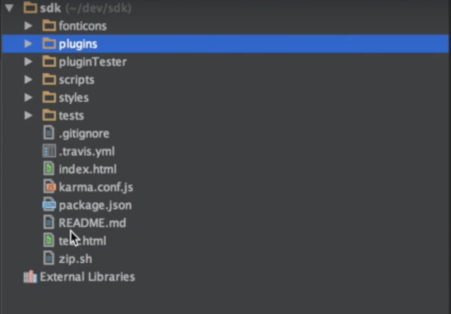

## Setting up Your Environment

You can setup your environment by following these steps: 

 1) Register on the [BuildFire Platform](http://dev.buildfire.com/pages/login.html).
 
 2) Download the [SDK on Github](https://github.com/BuildFire/sdk/archive/master.zip) .

 3) Open it in your Software Development Environment.

 4) You should see a folder hierarchy similar to this:
    
 
 5) Run the `index.html` in the main folder in localhost.

 6) Choose the "Test Plugin" button.

 7) You will be brought to the Plugin Tester section of the SDK with myPlugin as the default plugin.

 8) You can now start editing code

Checkout our video on [Creating your First Plugin](http://university.buildfire.com/knowledge-base/creating-your-first-plugin/)

 
